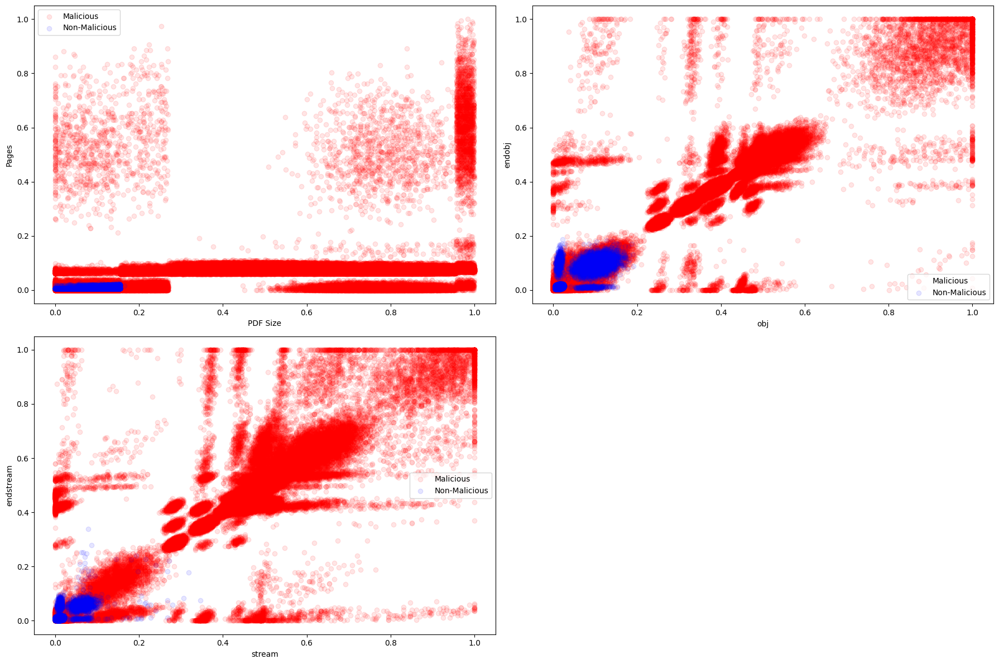
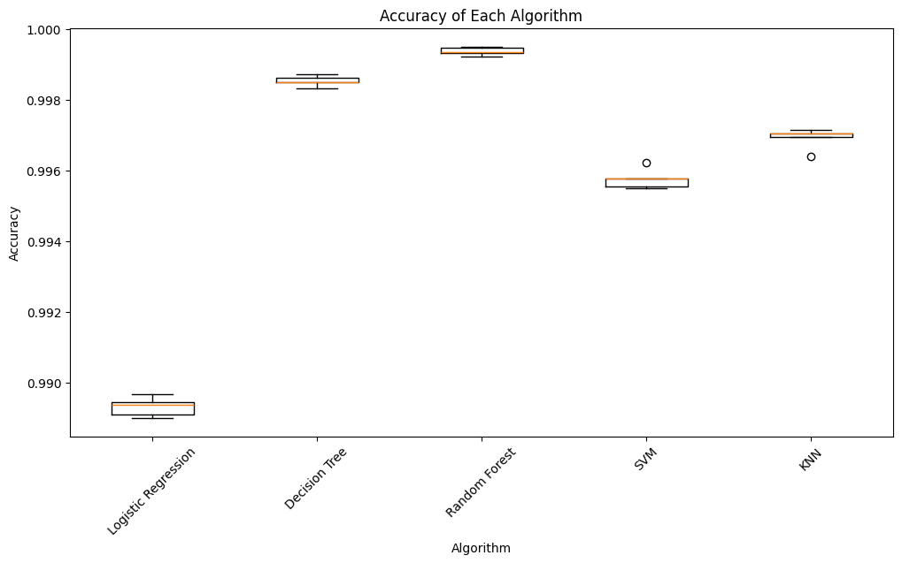
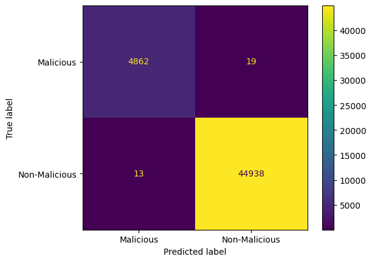

## Evasive PDF Samples
Given a dataset of Evasive PDF samples with 21 features containing 500,000 generated evasive samples, 450,000 are malicious and 50,000 are benign PDFs.

The **goal** is to predict which of them are malicious, which are labeled as (1) through the feature named 'class'.

## How to run
Open the EvasivePDFSamples.ipynb file in Jupyter Notebook and run the cells. The time to run everything is about 15 minutes.

## Group members
- Florentia-Styliani Diamantopoulou (up202311354@edu.fe.up.pt)
- Domingos (up202108728@edu.fe.up.pt)
- Maria Mitkou (up202311354@edu.fe.up.pt)
